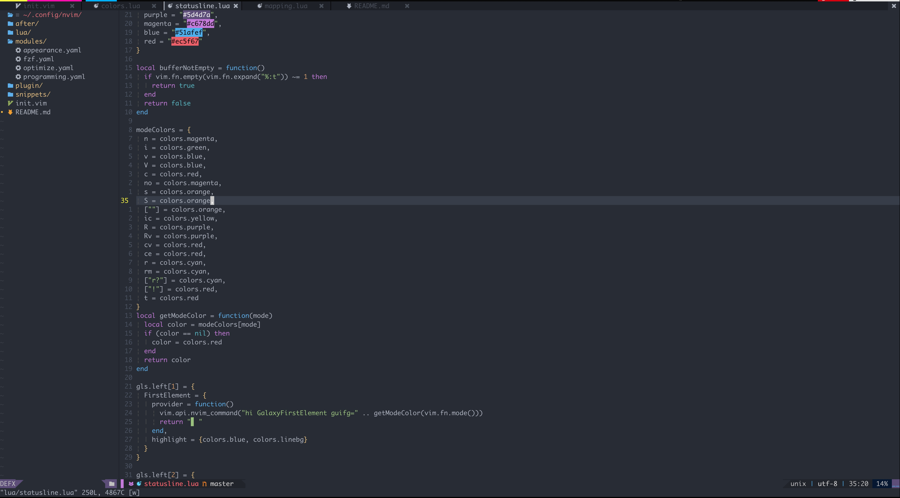

# My neovim setup



## Requirements

[Neovim Nightly (0.5)](https://github.com/neovim/neovim/releases/tag/nightly)

## Setup

### Clone

```shell
cd ~/.config && git clone https://github.com/tabsp/nvim.git
```
## pynvim

require Pythen3

```shell
pip install pynvim
```

for linux:

```shell
pip install pyyaml
```

## Language server

### gopls

```shell
go get golang.org/x/tools/gopls@latest
```

### typescript-language-server

```shell
npm install -g typescript-language-server
```

## Formt Code

### lua-fmt

[source](https://github.com/trixnz/lua-fmt)

```shell
npm install -g lua-fmt
```

## Optional

### bat

[source](https://github.com/sharkdp/bat)

```shell
brew install bat
```

### ripgrep

[source](https://github.com/BurntSushi/ripgrep)

```shell
brew install ripgrep
```

### Clipboard

#### Arch

```shell
pacman -S xsel
```

